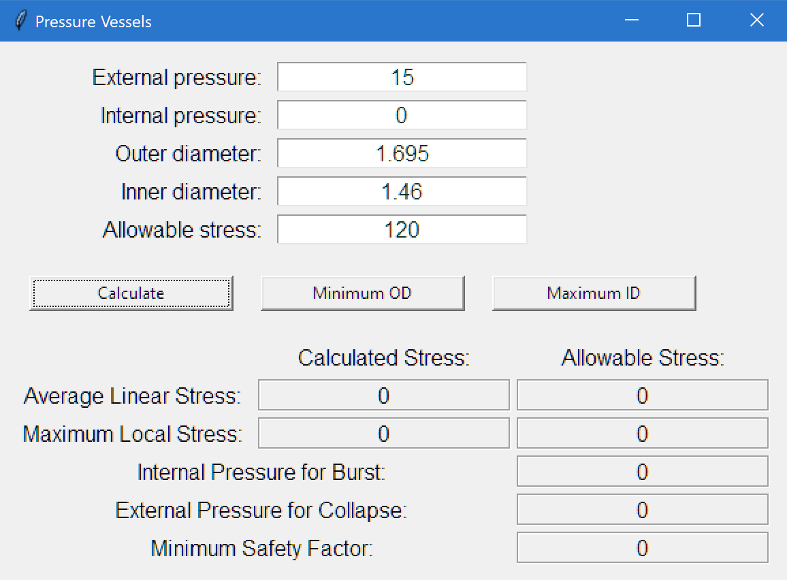

## Pressure Vessel stress calculator
Use this code to calculate the stresses in cylindrical pressure vessels. A 
calculator class, `Vessel`, and a GUI class, `PV_GUI`, are provided.  

### Purpose
The calculator is intended for use with relatively simple pressure housings, 
without fittings, welds, or variations in material. For more complex vessels, 
the calculator may be used as a first step for the overall stress levels, to be 
followed by specific analysis of stress concentrations.  

### Theory
Given the dimensions of the pressure vessel, the material strength, and the 
applied pressure, the von Mises stresses in the wall are calculated. A safety 
factor is determined using both the maximum von Mises stress and the average 
stress between the inner and outer wall surface. The average stress is limited 
to a smaller proportion of the maximum allowable stress, which requires that 
vessels with thinner walls have larger margins of safety.

The allowable stress value should be chosen to represent the worst-case material
strength while in use. By default, the tensile yield stress should be 
appropriate. If the service temperature is significantly higher than room
temperature, the allowable stress should be reduced to compensate for any loss 
of strength in the material. Similarly, if the tensile strength and compressive
strength are significantly different, choose the strength value corresponding
to the load case (i.e. tensile for internal pressure, compressive for external
pressure). 
___
## Getting Started

### Prerequisites
* No requirements outside the Python Standard Library

### Installation
You can install this package from this repo by using `pip`:
```
cd pressurevessels
pip install -e pressurevessels
```
Note the `-e` flag, which installs in editable mode and  allows you to modify 
the source at will after installing.  

___
## Usage
For direct use of the `Vessel` class, you can import the module:
```python
from pressurevessels import Vessel
```
and create a `Vessel` instance:
```python
v = Vessel(pExt, pInt, OD, ID, allowable_stress)
```  
After creating a `Vessel` instance, the following calculated properties are available:

* **Vessel.averagestress** : _The average of the inner and outer von Mises stresses_

* **Vessel.maxstress** : The maximum von Mises stress

* **Vessel.maxInternal** : The maximum allowable internal pressure, such that the 
minimum safety factor is 1.0

* **Vessel.maxExternal** : The maximum allowable external pressure, such that the minimum safety factor is 1.0

* **Vessel.SF** : The safety factor for the vessel, considering both the maximum
stress and the average stress.

Alternatively, the results can be printed by printing the Vessel instance:
```python
>>> vessel = Vessel(15, 0, 1.695, 1.460, 120)
>>> vessel
pExt: 15
pInt: 0
OD: 1.695
ID: 1.46
allowable_stress: 120
```

## Minimizing Wall Thickness
After creating a `Vessel` instance, the wall thickness can be minimized to 
reach a safety factor of 1.00, by modifying either the OD or ID.
* **Vessel.minimize_OD** : keeping the ID constant, set the OD to the smallest
value that results in a safety factor of 1.00
* **Vessel.maximize_ID** : keeping the OD constant, set the ID to the largest
value that results in a safety factor of 1.00
___
## Using the GUI window
To use the GUI from tkinter, you can execute the module with 
`python -m pressurevessels`

The GUI window resembles the following:


___
## Roadmap
* Unit conversions (US and SI)

## Contributing
Pull requests are welcome. For major changes, please open an issue first to discuss what you would like to change.

## License
[MIT](https://choosealicense.com/licenses/mit/)
